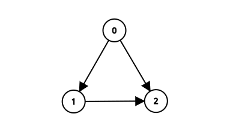

# Basic Dependency Resolution with Module

Commit:
https://github.com/hasheddan/crank/commit/212d70e0967a76c6997006f3bbd4a4d2c5f64ea1


Simple controller will unpack images by pulling top layer and looking at
`.registry/app.yaml`. It will look at `Module` and discover if dependencies are
present. If not, it will refuse to add the `Package` itself to the `Module`. In
the current examples, the following dependency tree exists:



0: crank-stack-root:v0.0.1 1: crank-stack-intermediate-one:v0.0.1 2:
crank-stack-intermediate-two:v0.0.1

This is a valid dependency graph with no cycles.

Start the manager:
```
$ go run main.go manager
```

Create the empty module:
```
$ kubectl apply -f examples/manifests/module-bare.yaml
```

Create `crank-stack-root` (0):
```
$ kubectl apply -f examples/stack/crank-stack-root/v0.0.1/package.yaml
```

Controller checks for dependencies. Neither (1 & 2) exist so `Package` cannot be
installed yet:
```
$ kubectl get package

NAME               READY   SOURCE   PACKAGE                             AGE
crank-stack-root   False            hasheddan/crank-stack-root:v0.0.1   8s
```

Create `crank-stack-intermediate-one` (1):
```
$ kubectl apply -f examples/stack/crank-stack-intermediate-one/v0.0.1/package.yaml
```

Controller checks for dependencies. Both (0 & 1) cannot be installed because
they depend on (2):
```
$ kubectl get package

NAME                                     READY   SOURCE   PACKAGE                                         AGE
crank-stack-root                         False            hasheddan/crank-stack-root:v0.0.1               96s
hasheddan-crank-stack-intermediate-one   False            hasheddan/crank-stack-intermediate-one:v0.0.1   5s
```

Create `crank-stack-intermediate-two` (2):
```
$ kubectl apply -f examples/stack/crank-stack-intermediate-two/v0.0.1/package.yaml
```

Controller checks for dependencies and sees (2) has none so it can be installed
(is written to `Module`). Next reconcile for (1) shows that its single
dependency on (2) is now satisfied so it can be installed. Next reconcile for
(0) after (1) is installed shows that both of its dependencies are present, so
it can be installed.

```
$ kubectl get package

NAME                                     READY   SOURCE   PACKAGE                                         AGE
crank-stack-root                         True             hasheddan/crank-stack-root:v0.0.1               4m8s
hasheddan-crank-stack-intermediate-one   True             hasheddan/crank-stack-intermediate-one:v0.0.1   2m37s
hasheddan-crank-stack-intermediate-two   True             hasheddan/crank-stack-intermediate-two:v0.0.1   18s
```
